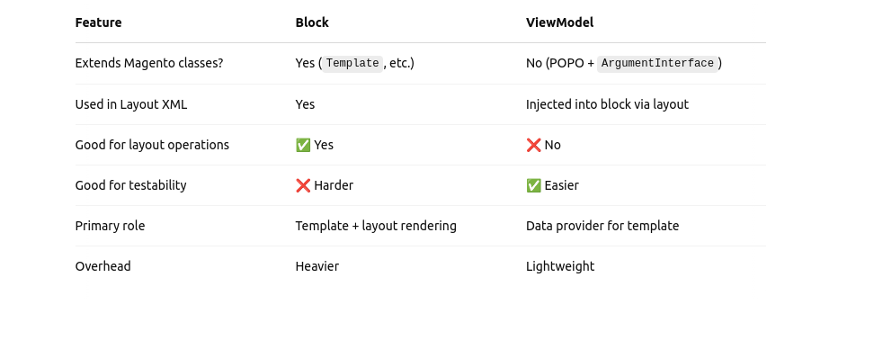

# ViewModel class

## 🧠 What is a ViewModel in Magento 2?

A **ViewModel** is a class that acts as a data provider for your template (PHTML file). It's a cleaner alternative to putting logic in block classes or templates. ViewModels are **better for separation of concerns**, and they are also **easier to test and reuse**.

### 🏗️ Step-by-step: Creating a ViewModel in Magento 2

Let’s say we want to create a ViewModel that provides some custom data to a template — maybe a store configuration value.

---

### 🗂️ 1. File Structure

Assume we have a module: `Vendor/Module`.

Here's where everything will go:

```bash
Vendor/
└── Module/
    ├── view/
    │   └── frontend/
    │       └── templates/
    │           └── example.phtml
    ├── ViewModel/
    │   └── Example.php
    └── etc/
        └── frontend/
            └── di.xml
```

---

### 🧾 2. Create the ViewModel Class

**File:** `Vendor/Module/ViewModel/Example.php`

```php
<?php
namespace Vendor\Module\ViewModel;

use Magento\Framework\View\Element\Block\ArgumentInterface;
use Magento\Store\Model\ScopeInterface;
use Magento\Framework\App\Config\ScopeConfigInterface;

class Example implements ArgumentInterface
{
    protected ScopeConfigInterface $scopeConfig;

    public function __construct(
        ScopeConfigInterface $scopeConfig
    ) {
        $this->scopeConfig = $scopeConfig;
    }

    public function getCustomConfigValue(string $path): ?string
    {
        return $this->scopeConfig->getValue(
            $path,
            ScopeInterface::SCOPE_STORE
        );
    }
}
```

💡 `ArgumentInterface` is what tells Magento this is a ViewModel.

---

### 🧩 3. Register ViewModel in `di.xml`

**File:** `Vendor/Module/etc/frontend/di.xml`

```xml
<?xml version="1.0"?>
<config xmlns:xsi="http://www.w3.org/2001/XMLSchema-instance" xsi:noNamespaceSchemaLocation="urn:magento:framework:ObjectManager/etc/config.xsd">
    <type name="Magento\Framework\View\Element\Template">
        <arguments>
            <argument name="viewModel" xsi:type="object">Vendor\Module\ViewModel\Example</argument>
        </arguments>
    </type>
</config>
```

❗ This registers your ViewModel so it can be injected into templates.

---

### 🧾 4. Using ViewModel in a Template

**File:** `view/frontend/templates/example.phtml`

```php
<?php
/** @var \Vendor\Module\ViewModel\Example $viewModel */
$customValue = $viewModel->getCustomConfigValue('web/unsecure/base_url');
?>
<p>Base URL: <?= $block->escapeHtml($customValue) ?></p>
```

Make sure the template is being rendered by a block or layout.

---

### injecting a ViewModel into the block

---

### Block vs ViewModel — What's the Deal?



---

## 🔁 All the Ways to Pass Data to Templates via Layout XML

Magento 2 lets you pass data to a template in a few powerful ways:

---

### ✅ 1. **Using `<arguments>` in Layout XML (Inline Values)**

You can hardcode values directly in the layout XML.

```xml
<block class="Magento\Framework\View\Element\Template" name="custom.block" template="Vendor_Module::example.phtml">
    <arguments>
        <argument name="message" xsi:type="string">Hello from layout</argument>
    </arguments>
</block>
```

In your template:

```php
echo $block->getData('message'); // Outputs: Hello from layout
```

---

### ✅ 2. **Passing Data via Block Class (Business Logic in PHP)**

```php
namespace Vendor\Module\Block;

class Example extends \Magento\Framework\View\Element\Template
{
    public function getMessage(): string
    {
        return 'Hello from block!';
    }
}
```

In layout XML:

```xml
<block class="Vendor\Module\Block\Example" name="custom.block" template="Vendor_Module::example.phtml"/>
```

In template:

```php
echo $block->getMessage(); // Outputs: Hello from block!
```

---

### ✅ 3. **Injecting a ViewModel (Modern, Clean Way)**

Layout XML:

```xml
<block class="Magento\Framework\View\Element\Template" name="custom.block" template="Vendor_Module::example.phtml">
    <arguments>
        <argument name="view_model" xsi:type="object">Vendor\Module\ViewModel\Example</argument>
    </arguments>
</block>
```

ViewModel PHP:

```php
namespace Vendor\Module\ViewModel;

use Magento\Framework\View\Element\Block\ArgumentInterface;

class Example implements ArgumentInterface
{
    public function getMessage(): string
    {
        return 'Hello from ViewModel!';
    }
}
```

In template:

```php
echo $viewModel->getMessage(); // Outputs: Hello from ViewModel!
```

---

### ✅ 4. **Using `$block->getData()` or `$block->setData()` Programmatically**

Inside controller or block:

```php
$block->setData('foo', 'bar');
```

Inside template:

```php
echo $block->getData('foo'); // Outputs: bar
```

---

## 🔎 ViewModel vs Block — Deep Dive Comparison

| Feature | Block | ViewModel |
|--------|-------|-----------|
| Inherits Magento Classes | ✅ Yes | ❌ No (Plain PHP) |
| Best for Layout Stuff | ✅ Yes | ❌ No |
| Testability | 😩 Hard | 😍 Easy |
| Used in | Templates & Layout | Templates only |
| Ideal for | Rendering logic, layout control | Business logic & data fetching |
| Constructor Injection | ✅ Yes | ✅ Yes |
| Extends `Template` or others | Yes | No |

---

## 🧰 Real World Use Cases

### 🧱 Use a **Block** when:

- You need access to layout methods like `getChildHtml()`.
- You need to manipulate layout or add child blocks.
- You’re dealing with rendering logic or template-specific data.

**Example**: Block for customer dashboard layout

```php
public function getRecentOrders() { ... }
```

---

### 👓 Use a **ViewModel** when:

- You want to inject services, fetch data, and pass it to the view — without coupling to layout.
- You want clean, testable code for frontend logic.
- You want to **separate business logic from presentation logic**.

**Example**: A ViewModel that returns current product SKU or some config value.

```php
public function getProductSku(Product $product): string
{
    return $product->getSku();
}
```

---

## 🧪 Practical Example — Side by Side

### ✅ 1. Block Class

```php
namespace Vendor\Module\Block;

class HelloBlock extends \Magento\Framework\View\Element\Template
{
    public function getGreeting(): string
    {
        return 'Hello from Block!';
    }
}
```

Layout XML:

```xml
<block class="Vendor\Module\Block\HelloBlock" name="hello.block" template="Vendor_Module::hello.phtml"/>
```

Template:

```php
<?= $block->getGreeting() ?>
```

---

### ✅ 2. ViewModel Class

```php
namespace Vendor\Module\ViewModel;

use Magento\Framework\View\Element\Block\ArgumentInterface;

class HelloViewModel implements ArgumentInterface
{
    public function getGreeting(): string
    {
        return 'Hello from ViewModel!';
    }
}
```

Layout XML:

```xml
<block class="Magento\Framework\View\Element\Template" name="hello.viewmodel" template="Vendor_Module::hello.phtml">
    <arguments>
        <argument name="view_model" xsi:type="object">Vendor\Module\ViewModel\HelloViewModel</argument>
    </arguments>
</block>
```

Template:

```php
<?= $viewModel->getGreeting() ?>
```

---

### 🧠 Pro Tips

- Use **ViewModels** for clean, reusable data fetchers.
- Use **Blocks** when you must interact with layout or Magento rendering.
- You can **combine them** — use a Block, inject ViewModel, and keep your templates razor-clean. 🍰

---

### ✅ Best Practices

- Keep logic out of templates — let ViewModels handle it.
- Always use dependency injection (no `ObjectManager` in your ViewModel).
- Return simple types (string, int, arrays, etc.) for easy templating.

---

## 🗂️ Folder Breakdown: `view/adminhtml`, `view/frontend`, `view/base`

These are **area-specific** folders. Magento has multiple "areas" of operation — basically different contexts where layout, templates, and assets are loaded.

---

### 🧾 `view/adminhtml/`

📍 This is the layout/templates **for the Magento Admin Panel**.

#### Used for

- Admin UI components
- Admin controllers
- Grids, forms, backend templates
- Layout XML specific to backend routes

#### Examples:
- `view/adminhtml/layout/sales_order_index.xml`
- `view/adminhtml/templates/form.phtml`
- `view/adminhtml/web/js/...`

💡 This folder only affects the **backend UI** (`/admin`).

---

### 🧾 `view/frontend/`

📍 This is the layout/templates **for the customer-facing storefront**.

#### Used for:
- Category/product pages
- Checkout
- Customer dashboard
- Layout XML and PHTML for frontend routes

#### Examples:
- `view/frontend/layout/catalog_product_view.xml`
- `view/frontend/templates/product/view.phtml`
- `view/frontend/web/css/...`

💡 This is your go-to for customizing what customers actually see.

---

### 🧾 `view/base/`

📍 This is a **shared fallback location** — usually only used by themes, not modules.

#### Used for:
- Storing assets (images, styles, JS) that should be shared across `frontend` and `adminhtml`
- Themes fall back to this folder if no more specific file is found in `frontend` or `adminhtml`

#### Examples:
- `view/base/web/images/logo.svg`
- `view/base/web/js/common-utils.js`

💡 Think of `base` as a **last resort or shared resource area**, especially in themes.

---

## 🧠 Summary Table

| Folder            | Area        | Purpose                              | When to Use It                            |
|-------------------|-------------|--------------------------------------|-------------------------------------------|
| `view/adminhtml`  | Backend     | Admin panel UI components            | Customizing admin forms, grids, buttons   |
| `view/frontend`   | Frontend    | Storefront UI                        | Product pages, checkout, customer account |
| `view/base`       | Shared      | Fallback/shared static assets        | Theme-level shared JS/CSS/images          |

---

## 🛠️ Developer Tip

Magento loads view files **based on the current area**:

- Visiting `/admin/sales/order`? → `adminhtml`
- Visiting `/product/my-product.html`? → `frontend`
- Loading CSS? Magento will check `frontend` first, then fallback to `base`
